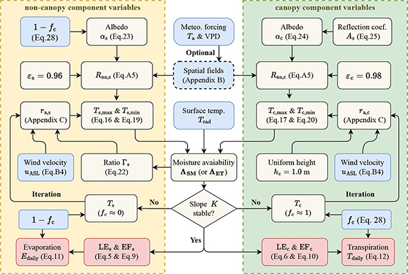

# IFEM remote sensing ET model for dual source

An Independent Framework-based Evapotranspiration Model (IFEM) for dual-source: from field to regional scale.

The IFEM model is a remote sensing-based land surface evapotranspiration retrieval model. It is a user-friendly model that allows for the easy estimation of surface evaporation and transpiration components with minimal required surface observation data.

