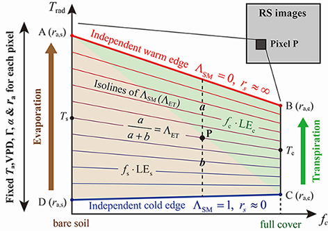

# IFEM remote sensing ET model for dual source

* [**💡 Introduction**](#-introduction)
* [**🧱 Operating environment**](#-operating-environment)
* [**🔮 User Guide for The Program**](#-user-guide-for-the-program)
* [**🧲 User Guide for The Extension**](#-user-guide-for-the-extension)
* [**📩 Contact Us**](#-contact-us)

## 💡 Introduction

This is the repository of **The Independent Framework-based Evapotranspiration Model (IFEM)** for dual-source.

The IFEM model is a remote sensing-based land surface evapotranspiration retrieval model. It is a **user-friendly** model that allows for the easy estimation of surface evaporation and transpiration components with minimal required surface observation data.

The IFEM model is based on the modeling approach of **Fractional vegetation cover (FVC) - land surface temperature (LST) feature space**. Compared to the classic theoretical trapezoidal framework such as [TTME(Long et al., 2012)](https://doi.org/10.1016/j.rse.2012.02.015), the advantage of IFEM lies in its fixation of five variables and parameters that affect the linear relationship between evaporation efficiency ($\Lambda_{\rm{ET}}$) and land surface temperature along the LST axis. These variables and parameters include **surface albedo ($\alpha$)**, **air temperature ($T_a$)**, **vapor pressure deficit (VPD)**, **aerodynamic resistance ($r_a$)**, and **the ratio of soil heat flux to net radiation ($\Gamma = G/R_n$)**. In other words, it assumes that the values of these five key variables and parameters do not change synchronously with land surface temperature (soil moisture availability $\Lambda_{\rm{SM}}$). Consequently, IFEM can construct a feature space domain with uniformly distributed evaporation efficiency isolines for each pixels.

## 🧱 Operating environment

The IFEM model is developed based on the **ENVI/IDL platform**. Before using this program, please make sure you have correctly installed **ENVI 5.3 (IDL 8.5)** or higher version on your personal computer or workstation.

## 🔮 User Guide for The Program

The program code can be compiled and executed in the ENVI/IDL environment. For individual routines, simply follow the steps below, modify the input parameters, and then run. However, if there is a need to process a large amount of data, IDLBridge technology can be used for parallel processing, and developers need to have knowledge of IDL programming.

* **Step1:** First, download the main IFEM program file [**IFEM_Main_Program.pro**](IFEM_Main_Program.pro) and open it using the IDL IDE (**File-->Open**).

* **Step2:** Input the necessary parameters for the model, including:
  * **Satellite overpass time** (Year, Month, Day and  decimal Hours in UTC);
  * **Instantaneous meteorological forcing observations** (Wind velocity, Air temperature and Vapor Pressure Deficit);
  * **Average meteorological forcing during daytime** (Air temperature maximum/minimum, Relative humidity maximum/minimum and Daylight hours) \[**Optional**\];
  * **Average altitude** of the study area.

 

* **Step3:** Preprocess the remote sensing data into raster files of the **surface albedo**, **land surface temperature**, and **Normalized Difference Vegetation Index (NDVI)** following the methodology described by [Allen et al. (2007)](https://doi.org/10.1061/(ASCE)0733-9437(2007)133:4(380)). Modify the corresponding file paths in the program.

* **Step4:** Finally, **compile** and **run** the IFEM main program.

## 🧲 User Guide for The Extension

This extension allows users to run IFEM models through the ENVI interactive interface without any IDL programming knowledge.

* **Step1:** Place the [IFEM extension file](IFEM_EXTENSION.sav) (.sav) in the extension folder under the ENVI installation path: `D:\...\ENVI53\extensions\...`. Then restart ENVI. The IFEM extension can be found in **Toolbox-->Extension**.

 

* **Step2:** Enter the parameters and raster file in the interactive interface, and then click the ‘**Execute**’ button to execute the IFEM program.

  
  
* **Step3:** The output results will be saved in the specified output path and **displayed in the ENVI window**.

## 📩 Contact us

 * Dr. **Shuai Wang**, Ninxia University, 214544015@qq.com;
* Prof. **Zailin Huo**, China Agricultural University, huozl@cau.edu.cn.

> **Please cite:** *[Wang, S., Wang, C., Zhang, C., Wang, W., Wang, P., Zhang, X., Wang, X., Rong, Y., Wang, D., Huang, G., Huo, Z., 2023. An independent framework-based evapotranspiration model (IFEM) for dual-source: From field to regional scale. Remote Sensing of Environment, 298, 113792. https://doi.org/10.1016/j.rse.2023.113792](https://doi.org/10.1016/j.rse.2023.113792)*
