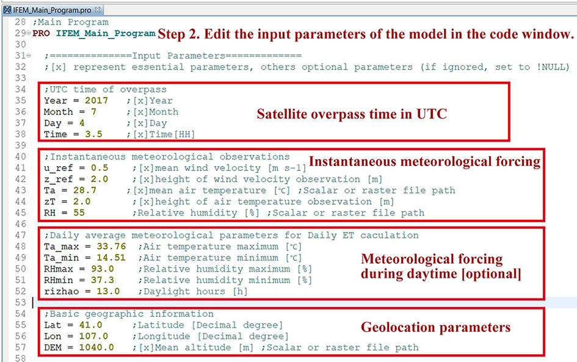

# IFEM remote sensing ET model for dual source

[**Introduction**](#-introduction)     [**User Guide**](#-user-guide)     

## 💡 Introduction

An Independent Framework-based Evapotranspiration Model (IFEM) for dual-source: from field to regional scale.

The IFEM model is a remote sensing-based land surface evapotranspiration retrieval model. It is a user-friendly model that allows for the easy estimation of surface evaporation and transpiration components with minimal required surface observation data.

The IFEM model is based on the modeling approach of **Fractional vegetation cover (FVC) - land surface temperature (LST) feature space**. Compared to the theoretical trapezoidal framework proposed by [Long et al. (2012)](https://doi.org/10.1016/j.rse.2012.02.015), the advantage of IFEM lies in its fixation of five variables and parameters that affect the linear relationship between evaporation efficiency ($\Lambda_{\rm{ET}}$) and land surface temperature along the LST axis. These variables and parameters include **surface albedo ($\alpha$)**, **air temperature ($T_a$)**, **vapor pressure deficit (VPD)**, **aerodynamic resistance ($r_a$)**, and **the ratio of soil heat flux to net radiation ($\Gamma = G/R_n$)**. In other words, it assumes that the values of these five key variables and parameters do not change synchronously with land surface temperature (soil moisture availability $\Lambda_{\rm{SM}}$). Consequently, IFEM can construct a feature space domain with uniformly distributed evaporation efficiency isolines for each pixels.

> **Please cite:** *[Wang, S., Wang, C., Zhang, C., Wang, W., Wang, P., Zhang, X., Wang, X., Rong, Y., Wang, D., Huang, G., Huo, Z., 2023. An independent framework-based evapotranspiration model (IFEM) for dual-source: From field to regional scale. Remote Sensing of Environment 298, 113792. https://doi.org/10.1016/j.rse.2023.113792](https://doi.org/10.1016/j.rse.2023.113792)*
> 
> **E-mail: 214544015@qq.com (Dr. Shuai Wang); huozl@cau.edu.cn (Professor Zailin Huo).**

## 🔮 User Guide

The IFEM model is developed based on the **ENVI/IDL platform**. Before using this program, please make sure you have correctly installed ENVI 5.3 (IDL 8.5) or higher version on your personal computer or workstation.

* **Step1:** First, download the main IFEM program file [IFEM_Main_Program.pro](IFEM_Main_Program.pro) and open it using the IDL IDE.

* **Step2:** Input the necessary parameters for the model, including:
  * Satellite overpass time (Year, Month, Day and  decimal Hours in UTC);
  * Instantaneous meteorological forcing observations (Wind velocity, Air temperature and Vapor Pressure Deficit);
  * Average meteorological forcing during daytime (Air temperature maximum/minimum, Relative humidity maximum/minimum and Daylight hours) \[**Optional**\];
  * Average altitude of the study area.

 

* **Step3:** Preprocess the remote sensing data into raster files of surface albedo, land surface temperature, and Normalized Difference Vegetation Index (NDVI) following the methodology described by [Allen et al. (2007)](https://doi.org/10.1061/(ASCE)0733-9437(2007)133:4(380)). Modify the corresponding file paths in the program.

* **Step4:** Finally, compile and run the IFEM main program.

